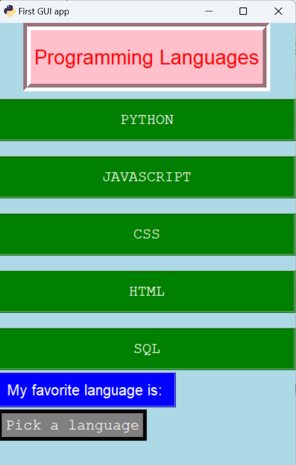
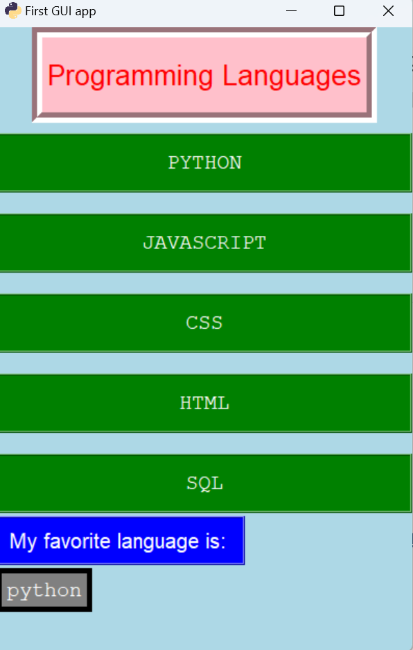

# PROJECTS-tkinter-simple
Learning tkinter 
-this little app displays a list of 5 programming languages 
-the user can select their favorite language, which changes the text in the label, and prints output to cli

<!--      --> 

***

