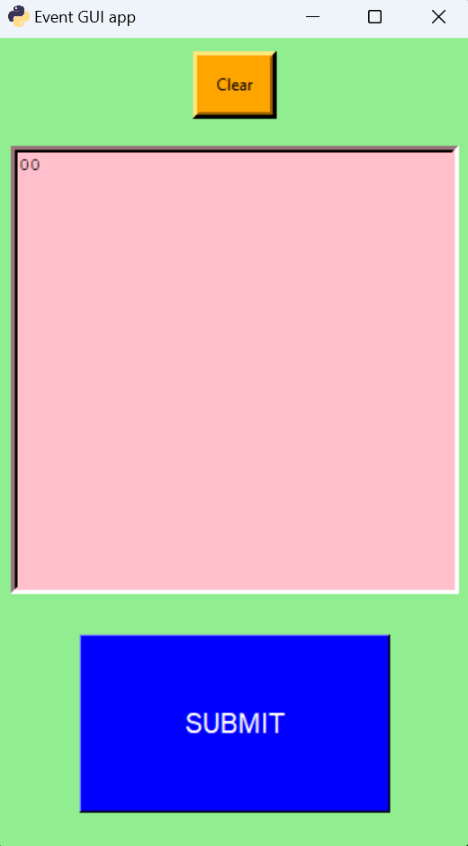
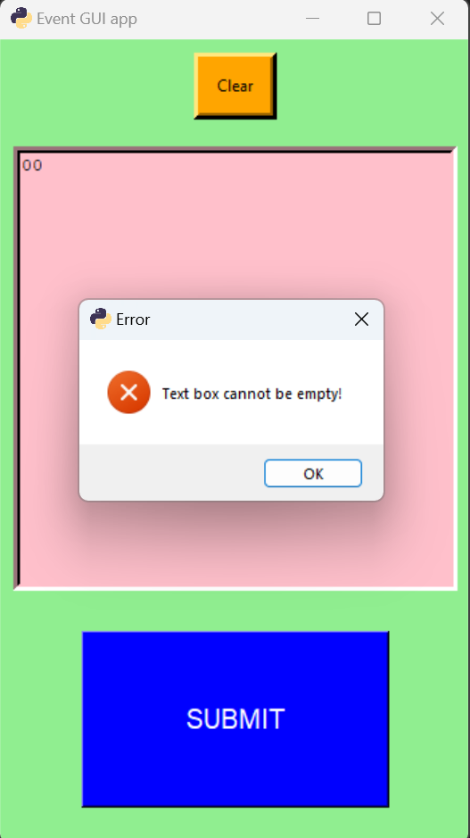

# TKINTER - EVENTS with bind
Learning tkinter 
-progression of adding functionality,  events.py -> events1.py, ---> events9.py   
-the user can change the background color by pressing '0', can enter text, clear the text, submit the text, etc.  

<!--      --> 

***

***

***

