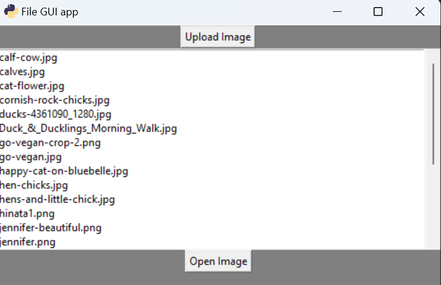
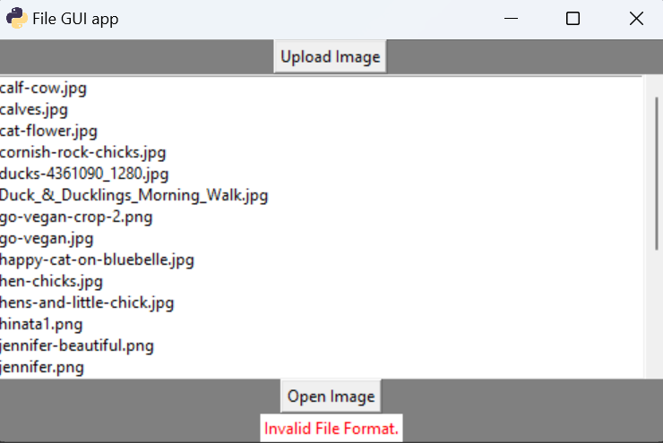
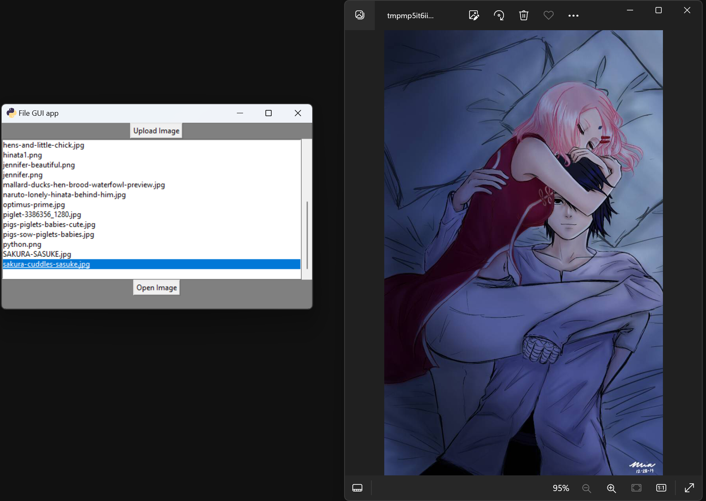

# FILE_UPLOAD
Learning tkinter 
-this little app allows for  uploading images, and viewing images 
-file uploads are restricted to image file types, and < 2 MB

***

***

ERROR!   Image Files Only!
***

***
